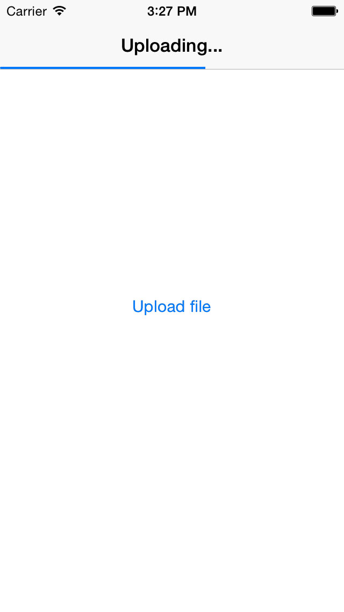

# FMAssetStream

## Usage

To run the example project, clone the repo, and run `pod install` from the Example directory first.  The example is a all ready to go and will actually upload a test file to a remote server to demonstrate functionality.  Definitely take a look at the example to see how things work.

When you want to use FMAssetStream in your own project do the following...

You'll need to import the category:

    #import <FMAssetStream/NSMutableURLRequest+FMAssetStream.h>
    
Then use `setAsset` on your NSMutableURLRequest:

    NSMutableURLRequest *request = [[NSMutableURLRequest alloc] initWithURL:[NSURL URLWithString:@"https://example.com/upload"]];
    [request setAsset:asset delegate:assetStreamDelegate];

The `assetStreamDelegate` reference here must implement the following method for progress updates:

    - (void) progressBytes:(long long)progress totalBytes:(long long)total{
        float percentage = (float)progress / (float)total;
        [self updateProgressUI: percentage];
    }

## Installation

FMAssetStream is available through [CocoaPods](http://cocoapods.org). To install
it, simply add the following line to your Podfile:

    pod "FMAssetStream"

## Author

Kyle Shank, kyle@formalmethod.net

## License

FMAssetStream is available under the MIT license. See the LICENSE file for more info.

